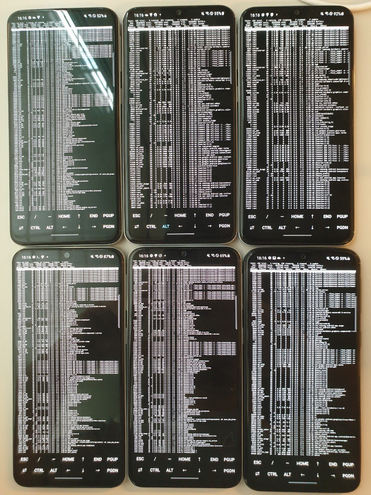

# Fuzz Android Native Components on Phone Cluster

Fuzzing framework, built on top of AFL++, to dynamically test native components of closed-source Android applications. 
The framework is composed of:

* **a patched version of AFL++**, needed to port it on an Android device;
* **a native method's signatures extractor**, working with applications APKs;
* **a fuzzing harness dealing with the JNI**, the function pointer extraction and the fork server;
*  **3 fuzzing drivers** required to parallelize each fuzzing campaign per device on a phone cluster.

The results when using the framework on closed-source Android applications show that it is capable of both reproducing known CVEs in Android native components, and discovering new bugs.

## Requirements
* All Android devices must be rooted

* All Android devices must have a connection with the central machine through ADB, either over a TCP/IP connection or with multiple USB ports. Steps  to set-up TCP/IP connection (source [here](https://stackoverflow.com/questions/43973838/how-to-connect-multiple-android-devices-with-adb-over-wifi)):
  1. connect device with USB cable to PC
  2. `adb -d tcpip 5555`
  3. `adb connect <device_ip_addr>` and remove USB cable
  4. repeat for all other devices
  
* All Android devices must have a built version of *AFLplusplus-AndroidPatches* (get it from [here](https://github.com/paocela/AFLplusplus-AndroidPatches))

* to use only after running the script `analyze_native_signatures.sh` in folder `/APK_signature_analysis_and_fuzzer`: this guarantees that `/target_APK` folder structure is (for each app):

  ```
  ## Before Analysis ##
  ├── target_APK/
  │   ├── App-Name/
  │   │	└── base.apk
  │   └── ...
  
  ## After Analysis ##
  ├── target_APK/
  │   ├── App-Name/
  │   │	├── base/
  │   │	├── lib/
  │   │   │   └── arm64-v8a/
  │   │	├── base.apk
  │   │	└── signatures_pattern.txt
  │   └── ...
  ```

* `APK_signature_analysis_and_fuzzer/harness.cpp` written based on the target choice

## Usage

```
python fuzzing_manager.py [-h] --action {fuzz_signature,fuzz_one,check, kill_fuzzer} [--target TARGET]
                          [--fuzz_time FUZZ_TIME] [--from_file FROM_FILE] [--parallel_fuzzing PARALLEL_FUZZING]


Fuzz Android native libraries functions with given signature on multiple devices through ADB

optional arguments:
  -h, --help            show this help message and exit
  --action {fuzz_signature,fuzz_one,check, kill_fuzzer}
                        *fuzz_signature* to fuzz all functions given a signature, *fuzz_one* to fuzz given function name, *check* to check on each fuzzing campaings,   *kill_fuzzer* to kill on all device processes connected to the campaign
  --target TARGET       
                        Fuzzing target signature or method, or device to kill, e.g. String:String,Int, or Java_... or 192.168... (depending on --action)
  --fuzz_time FUZZ_TIME
                        Time to fuzz for, of type float[s|m|h|d] (s=seconds, m=minutes, h=hours,
                        d=days)
  --from_file FROM_FILE
                        If True, harness get AFL++ input from file, else from stdin
  --parallel_fuzzing PARALLEL_FUZZING
                        Specify number N of cores to use for a parallel fuzzing campaign (if N > #cores, then max #cores is used)
```

## Components

```
.
├── APK_signature_analysis_and_fuzzer/
├── Root-Samsung-A40/
├── adb.py
├── fuzzing_manager.py
└── README.md
```

* **/APK_signature_analysis_and_fuzzer**: contains the actual fuzzing framework, composed of APK static analysis tools (signature extractor), harnesses, fuzzing driver and relative folders
* **/Root-Samsung-A40**: steps to root a Samsung-A40 phone
* **adb.py**: python library to integrate ADB commands
* **fuzzing_manager.py**: manage interaction with all devices connected, start fuzzing campains and fetch intermediary results
* **README.md**: this README

## Example Setup


